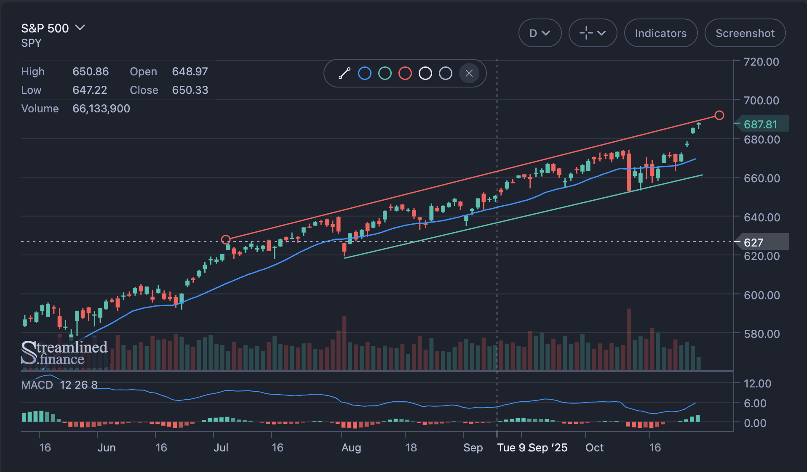

# Streamlined Charts

Charting Library with Financial Candlesticks Chart that provides an alternative to TradingView



## Attribution Note

This chart is the one used by [Streamlined Finance](https://www.streamlined.finance). It is free to use, provided that attribution is maintained by keeping the logo visible in the chart.

If you encounter any issues or have suggestions, please [open an issue](https://github.com/streamlinedfi/charts/issues) in the repository.

## Installation

```
# with Yarn
$ yarn add @streamlinedfi/charts styled-components

# with npm
$ npm i @streamlinedfi/charts styled-components

# with pnpm
$ pnpm add @streamlinedfi/charts styled-components

# with Bun
$ bun add @streamlinedfi/charts styled-components
```

## Basic Setup

CandlesCharts works like a controlled component, where you provide the config and the data.

```jsx
import { CandlesChart } from '@streamlinedfi/charts';

const defaultRequestBars = 100;

const TimeFrames = {
  M1: 'M1',
  M3: 'M3',
  M5: 'M5',
  M10: 'M10',
  M15: 'M15',
  M20: 'M20',
  M30: 'M30',
  H1: 'H1',
  H2: 'H2',
  H4: 'H4',
  D1: 'D1',
  W1: 'W1',
};

// timeframes need a text and id property
const timeframes = {
  [TimeFrames.M15]: {
    text: '15m',
    id: TimeFrames.M15,
  },
  [TimeFrames.M30]: {
    text: '30m',
    id: TimeFrames.M30,
  },
  [TimeFrames.H1]: {
    text: '1h',
    id: TimeFrames.H1,
  },
  [TimeFrames.H4]: {
    text: '4h',
    id: TimeFrames.H4,
  },
  [TimeFrames.D1]: {
    text: 'D',
    id: TimeFrames.D1,
  },
  [TimeFrames.W1]: {
    text: 'W',
    id: TimeFrames.W1,
  },
};

// format the data like this:
const data = [
  {
    time: 1742961600000,
    open: 575.19,
    high: 576.33,
    low: 567.19,
    close: 568.59,
    volume: 51848300,
  },
  {
    time: 1742961600000,
    open: 575.19,
    high: 576.33,
    low: 567.19,
    close: 568.59,
    volume: 51848300,
  },
];

function App() {
  const [loading, setLoading] = useState(true);
  const [fullscreen, setFullscreen] = useState(false);
  const [timeframe, setTimeframe] = useState(timeframes.D1);
  const [config, setConfig] = useState({});

  return (
    <CandlesChart
      loading={loading}
      config={{
        width: 960,
        height: 560,
        symbol: {
          name: 'Apple Inc.',
          code: 'AAPL',
        },
        decimals: 2,
        symbolClick: true,
        fullscreen: false,
        showFullscreenButton: false,
        initialCandlesWindow: defaultRequestBars,
        timeframe,
        timeframes: values(timeframes),
        timeframesMenu: {
          Minute: [timeframes.M15, timeframes.M30],
          Hour: [timeframes.H1, timeframes.H4],
          'Day/Week': [timeframes.D1, timeframes.W1],
        },
      }}
      data={data}
      onConfig={setConfig}
      onTimeframeChange={setTimeframe}
      onLoadMore={() => {
        console.log('load more candles and update data...');
      }}
      onSymbolClick={() => {
        console.log('symbol clicked, code your');
      }}
      onFullscreen={setFullscreen}
    />
  );
}
```

## Custom Theme

You can fully customize the chart's theme by passing a `theme` property to the `config` prop, using the following structure:

```js
config.theme = {
  colors: 'string[]',
  bgColor: 'string',
  borderRadius: 'number',
  primary: 'string',
  lineColor: 'string',
  lineWidth: 'number',
  lineCircleSize: 'number',
  candleUpColor: 'string',
  candleDownColor: 'string',
  fontFamily: 'string',
  fontSize: 'number',
  fontWeight: 'number',
  color: 'string',
  padding: '[number, number, number, number]',
  title: {
    fontSize: 'number',
    marginBottom: 'number',
    color: 'string',
    colorHover: 'string',
  },
  subtitle: {
    fontSize: 'number',
    marginBottom: 'number',
    color: 'string',
    colorHover: 'string',
  },
  header: {
    angleDownSize: 'number',
    angleDownColor: 'string',
    angleDownColorHover: 'string',
    toolbarBorderColor: 'string',
    buttonFontSize: 'number',
    buttonColor: 'string',
    buttonColorHover: 'string',
    buttonColorActive: 'string',
    buttonBgColorActive: 'string',
    buttonBorderColor: 'string',
    buttonBorderColorActive: 'string',
    marginRight: 'number',
    background: 'string',
  },
  legend: {
    fontSize: 'number',
    color: 'string',
    itemMarginRight: 'number',
    itemMarginBottom: 'number',
    marginBottom: 'number',
    circle: {
      positionTop: 'number',
      size: 'number',
      marginRight: 'number',
      lineWidth: 'number',
    },
  },
  grid: {
    lineColor: 'string',
    showY: 'boolean',
    showX: 'boolean',
  },
  axes: {
    fontSize: 'number',
    color: 'string',
    emphasizeColor: 'string',
    lineColor: 'string',
    tickColor: 'string',
    tickSize: 'number',
    tickMargin: 'number',
    lastValueTickBgSize: 'number',
    xEndShiftRatio: 'number',
    minTickWidthX: 'number',
    minTickSpaceY: 'number',
    hoverColor: 'string',
  },
  indicatorWindow: {
    splitLineColor: 'string',
    splitLineWidth: 'number',
    bgColor: 'string',
    color: 'string',
    settingsColor: 'string',
  },
  crosshair: {
    color: 'string',
    tickColor: 'string',
    tickBgColor: 'string',
    lineColor: 'string',
    lineDash: '[number, number]',
  },
  ohlcvOverlay: {
    keyColor: 'string',
    valueColor: 'string',
    fontSize: 'number',
    overlayMarginTop: 'number',
    overlayMarginBottom: 'number',
    overlayMarginRight: 'number',
    itemMarginBottom: 'number',
    itemMarginRight: 'number',
    colMarginRight: 'number',
  },
  menu: {
    bgColor: 'string',
    borderColor: 'string',
    borderWidth: 'number',
    borderRadius: 'number',
    padding: 'number',
    item: {
      padding: 'number',
      fontSize: 'number',
      color: 'string',
      colorHover: 'string',
      colorActive: 'string',
      bgColorHover: 'string',
      bgColorActive: 'string',
      borderRadius: 'number',
    },
  },
  input: {
    labelColor: 'string',
    labelBgColor: 'string',
    color: 'string',
    bgColor: 'string',
    bgColorHover: 'string',
    bgColorDarker: 'string',
    bgColorDarkerHover: 'string',
  },
  button: {
    borderColor: 'string',
    borderColorHover: 'string',
    borderColorActive: 'string',
    color: 'string',
    colorHover: 'string',
    colorActive: 'string',
  },
  popoverMenu: {
    zIndex: 'number',
    background: 'string',
    bgColor: 'string',
    borderColor: 'string',
    color: 'string',
    uppercaseColor: 'string',
  },
  indicatorsMenu: {
    titleColor: 'string',
    subtitleColor: 'string',
    indicatorTextColor: 'string',
    borderColor: 'string',
    settingsColor: 'string',
    buttonBgColor: 'string',
    buttonBorderColor: 'string',
    buttonBorderColorActive: 'string',
    labelColor: 'string',
    addIconColor: 'string',
    addIconColorActive: 'string',
    settingsColorActive: 'string',
    removeIconColor: 'string',
  },
  drawingToolbar: {
    colors: 'string[]',
    iconColor: 'string',
    bgColor: 'string',
    borderColor: 'string',
    closeColor: 'string',
    closeBgColor: 'string',
    textColor: 'string',
    textColorActive: 'string',
    textBgColor: 'string',
  },
  switch: {
    activeBgColor: 'string',
    inactiveBgColor: 'string',
    activeColor: 'string',
    inactiveColor: 'string',
  },
  dragList: {
    topZIndex: 'number',
    borderColor: 'string',
    bgColorHover: 'string',
    handleBgColorHover: 'string',
    handleColor: 'string',
  },
  close: {
    bgColorActive: 'string',
    color: 'string',
    colorHover: 'string',
    colorActive: 'string',
  },
  indicators: {
    bb: {
      bgColor: 'string',
      upperlineColor: 'string',
      middlelineColor: 'string',
      lowerlineColor: 'string',
    },
    macd: {
      bgColor: 'string',
      histogramColor: 'string',
      histogramBgColor: 'string',
      signalLineColor: 'string',
      signalLineBgColor: 'string',
      histogramBarColor: 'string',
      histogramBarBgColor: 'string',
    },
    roc: {
      zeroLineColor: 'string',
    },
    rsi: {
      bgColor: 'string',
      upperLineColor: 'string',
      lowerLineColor: 'string',
      middleLineColor: 'string',
    },
    stochastic: {
      bgColor: 'string',
      upperLineColor: 'string',
      lowerLineColor: 'string',
      middleLineColor: 'string',
    },
  },
};
```
